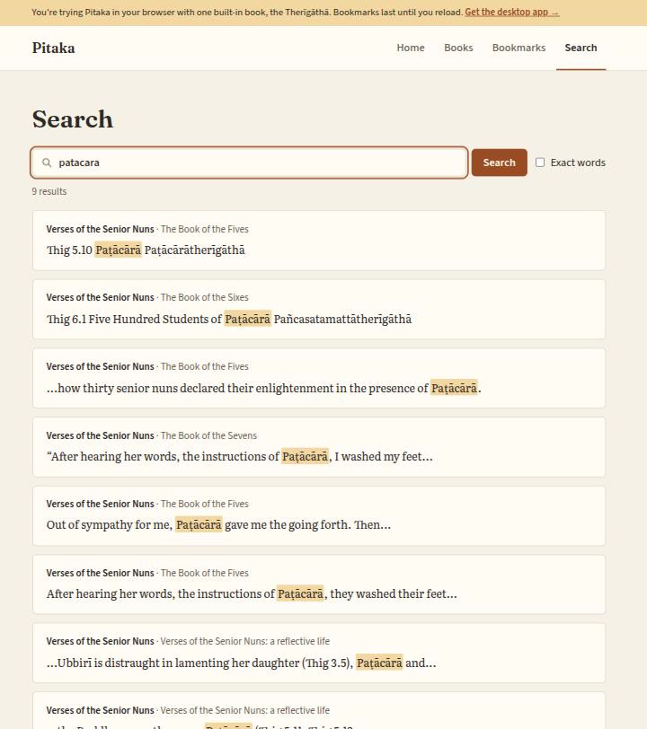
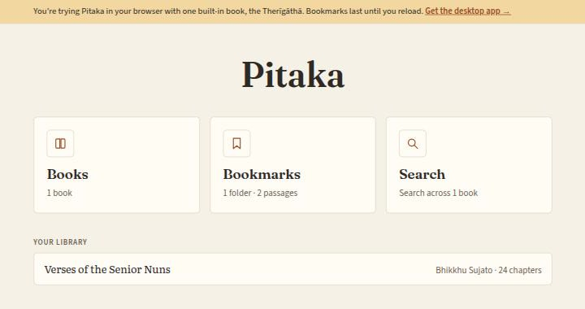
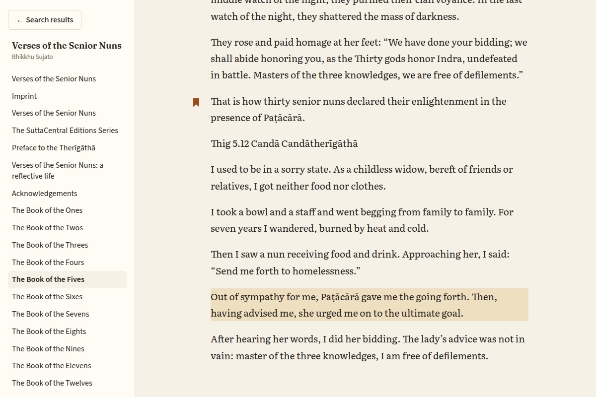
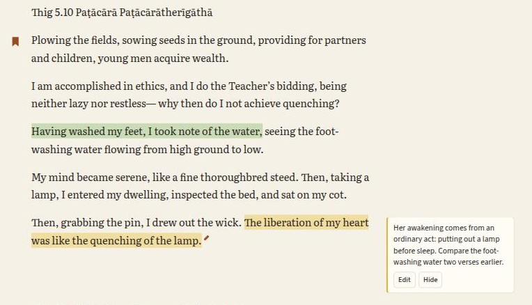
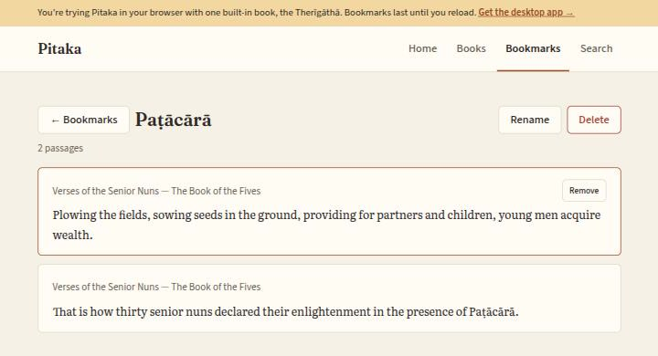

# Pitaka

[](https://github.com/mstyles/pitaka/actions/workflows/ci.yml)

A desktop app for reading and researching your EPUB library: full-text
search across every book, bookmark folders for the passages you want
to keep, and highlights and notes as you read.

**[Try it in your browser](https://mstyles.github.io/pitaka/demo/)** ·
[Website](https://mstyles.github.io/pitaka/)



- **Search your whole library at once.** Every paragraph of every book is
  indexed, results are ranked with the matching words highlighted, and
  "learn" also finds "learning" (or tick *Exact words*). Case and
  diacritics are ignored, so `samsara` finds "saṃsāra", and `dharma`
  also finds a text that only writes "dhamma". Quoted phrases,
  `prefix*` and `AND`/`OR`/`NOT` work too.
- **Find chapters by meaning.** Describe what you're after — "dealing with difficult emotions" — and
  get the chapters about it, whatever words they use. A small embedding
  model runs on your own computer; it's downloaded once and nothing is
  sent anywhere.
- **Read with the hit in context.** Opening a result jumps the reader to
  that paragraph, with the book's chapters alongside.
- **Highlight and write notes.** Select words in a paragraph to
  highlight them in one of four colours, and note a highlight or a whole
  paragraph. Notes open in the margin beside the text, and each book's
  highlights and notes are listed in reading order.
- **Keep passages in bookmark folders**, one per topic or project, each
  passage linked back to its place in the book.
- **Bring in a whole folder.** Import one EPUB, or pick a folder and
  every EPUB under it is imported, Calibre's `Author/Title/` layout
  included, skipping the ones already in your library.
- **Local and private.** Your books are indexed into a SQLite database on
  your own computer; nothing is uploaded anywhere.

The browser demo is the real interface with one built-in book, the
Therīgāthā (*Verses of the Senior Nuns*), and a search that works like
the app's. Importing your own books needs the desktop app.

| Home | Reader | Notes | Bookmarks |
| --- | --- | --- | --- |
|  |  |  |  |

**Contents:** [Install](#install) · [Licence](#licence) ·
[Contributing](#contributing) · [How it's built](#how-its-built) ·
[What's actually verified](#whats-actually-verified) ·
[Project structure](#project-structure) ·
[Schema migrations](#schema-migrations) · [Setup steps](#setup-steps) ·
[Known limitations](#known-limitations) · [Roadmap](#roadmap) ·
[Releasing](#releasing) · [Workflow roadmap](#workflow-roadmap)

## Install

Download the installer for your system from the
[Releases](https://github.com/mstyles/pitaka/releases) page. Chapter
search by meaning is included.

- **Windows**: `Pitaka_x.y.z_x64-setup.exe` installs for your user only,
  with no admin rights needed; the `.msi` is there too if you'd rather.
  The installers aren't code-signed yet, so Windows SmartScreen shows
  "Windows protected your PC" before running them: choose **More info**,
  then **Run anyway**.
- **Linux**: the `.AppImage` runs without installing, on any distro
  (`chmod +x`, then run it). Or install the `.deb` on Debian or Ubuntu
  (`sudo apt install ./Pitaka_*.deb`), or the `.rpm` on Fedora or
  openSUSE. All three are built on Ubuntu 22.04, so they need a system
  at least that new (Debian 12, Fedora 36 and their peers).
- **macOS**: there's no installer yet; build from source below. The
  macOS build is untested.

`SHA256SUMS` on each release lists every file's checksum: check a
download with `sha256sum -c SHA256SUMS --ignore-missing`.

The first time a book is indexed for chapter search, or a chapter search
is run, the app downloads
[BAAI/bge-small-en-v1.5](https://huggingface.co/BAAI/bge-small-en-v1.5)
(about 130 MB) into `~/.cache/huggingface` (`%USERPROFILE%\.cache\huggingface`
on Windows); after that it works offline.

The library lives in `library.db` in the app's data directory
(`~/.local/share/com.pitaka.app/` on Linux, `%APPDATA%\com.pitaka.app\`
on Windows). Imported books are indexed there; the EPUB files
themselves are never modified.

### Build from source

Pitaka builds and is tested on Linux and Windows; Tauri also targets
macOS, but that build is untested.

1. Install [Rust](https://rustup.rs) and [Node.js](https://nodejs.org)
   (24 is what CI uses), plus Tauri's system libraries. On Debian or
   Ubuntu:

   ```
   sudo apt update && sudo apt install -y libwebkit2gtk-4.1-dev \
     libjavascriptcoregtk-4.1-dev libxdo-dev libssl-dev \
     libayatana-appindicator3-dev librsvg2-dev libdbus-1-dev pkg-config
   ```

   On Windows, use Rust's default MSVC toolchain and install
   [Visual Studio Build Tools](https://visualstudio.microsoft.com/visual-cpp-build-tools/)
   with "Desktop development with C++". The WebView2 runtime comes with
   Windows 10 and 11.

   Other systems: see [Tauri's prerequisites](https://v2.tauri.app/start/prerequisites/).
2. `git clone https://github.com/mstyles/pitaka && cd pitaka && npm install`
3. `npm run tauri build`, then install or run a bundle from
   `target/release/bundle/`. Or `npm run tauri dev` to run it straight
   from the checkout.

In a build from source, chapter search by meaning is behind a Cargo
feature, off by default (the release installers have it on): add
`-- --features semantic` to either command (`npm run tauri dev --
--features semantic`). The first build takes longer, as it compiles the
model runtime ([candle](https://github.com/huggingface/candle)); the
model downloads on first use, as above. Only books imported while the
feature is on are indexed (see [Known limitations](#known-limitations)).

## Licence

Pitaka is licensed under either of [MIT](LICENSE-MIT) or
[Apache 2.0](LICENSE-APACHE), at your option. The bundled fonts
(Fraunces, Literata and Source Sans 3) are under the SIL Open Font
License; their licences are in `src/assets/fonts/`. The demo's book,
*Verses of the Senior Nuns* translated by Bhikkhu Sujato, is dedicated to
the public domain (CC0) by [SuttaCentral](https://suttacentral.net); see
[`demo/README.md`](demo/README.md).

## Contributing

Bug reports and fixes are welcome. See [CONTRIBUTING.md](CONTRIBUTING.md)
for how to set up, which checks to run, and how pull requests work, and
[SECURITY.md](SECURITY.md) for reporting a vulnerability privately.
Changes between versions are in [CHANGELOG.md](CHANGELOG.md).

## How it's built

EPUB parsing + SQLite/FTS5 search, wrapped in a Tauri v2 shell (React +
TypeScript frontend). The Rust side is split into two crates on purpose:

- `ebook_research_core/` — all the real logic (EPUB parsing, offsets,
  DB schema/search ranking). No Tauri or UI dependency at all, so the
  hard parts are unit/integration-testable without ever spinning up a
  webview.
- `src-tauri/` — a thin Tauri command layer on top of the core crate
  (`src-tauri/src/commands.rs`), plus the app shell (`lib.rs`/`main.rs`).

This is a Cargo workspace (root `Cargo.toml`) with both crates as
members, sharing one `Cargo.lock`/`target/`.

The app's identity is in `src-tauri/tauri.conf.json`. `identifier`
(`com.pitaka.app`) names the data directory, so changing it would lose
every user's library. `bundle.windows.wix.upgradeCode` is pinned
because Tauri would otherwise derive it from `productName`: if it ever
changes, Windows treats the next MSI as a different app and installs it
alongside the old one. Neither may change. The version comes from
`src-tauri/Cargo.toml`.

## What's actually verified

- `ebook_research_core/src/epub.rs` — unzips an EPUB, walks
  `META-INF/container.xml` → the OPF manifest/spine → each chapter's
  XHTML, and splits it into paragraphs (`p`, `div`, `h1`-`h6`, `li`,
  `blockquote`) with char offsets. A block that directly contains text
  is one paragraph, nested blocks included; a block that only wraps
  other blocks is split into them. Text split across inline tags is
  joined as written, so a drop cap like `<b>B</b>EFORE` reads
  "BEFORE". Each chapter's title is its first `<h1>`/`<h2>`, falling
  back to the file's first entry in the book's table of contents (the
  EPUB 3 nav document's `toc` nav, else the EPUB 2 NCX), then to the
  document's `<head><title>` (so a half-title page with neither gets the
  book's name) and then to the internal file path. TOC hrefs are
  resolved against the TOC file's own folder, with `#fragments`, `..`
  and `%20`-style escapes handled. Checked by parsing the three books in
  `~/Documents/books`: *Understanding Our Mind* now has "I - The Mind Is
  a Field", "2 - Every Kind of Seed" and so on instead of 65 chapters
  named after the book, and *No Mud, No Lotus* has "1: The Art of
  Transforming Suffering". Files the TOC doesn't list (the HTML
  contents page, some front and back matter, footnotes) still get their
  `<head><title>`, which is often the book's name. Not yet checked by
  re-importing the books in the Tauri window; no UI code changed, so
  it wasn't clicked through against the mocked backend either.
  The EPUB 3 navigation document (the manifest item whose `properties` include `nav`) is skipped, so the
  table of contents isn't a chapter or a source of search hits;
  `linear="no"` items and cover pages are kept, since they can hold
  real text such as notes. Checked against *Understanding Our Mind*
  (div-based) by running the parser directly: drop-cap words are no
  longer split, and each footnote is one paragraph with its number.
  Text using HTML named entities (`&nbsp;`, `&mdash;`) is decoded:
  quick-xml 0.42 reports each entity as its own event, which is
  resolved through its `escape-html` feature. A bare `&` ("Faith &
  Reason") or an unknown `&foo;` is kept as written, in chapter text, TOC labels
  and the OPF title and author; before, such a text node was dropped,
  and a bare `&` in `<dc:title>` failed the import. Markup that never
  closes (a broken `<!- x ->` comment, an unclosed `<!--`, a misspelt
  `<![CDAT[`) is skipped and parsing resumes after it with the open
  elements kept, instead of the rest of the chapter being lost; the
  OPF and TOC readers share this recovery, so broken markup there no
  longer fails the import or cuts the TOC short. Unit
  tests in `epub.rs` cover each case, and running the parser over the
  six books in `~/Documents/books` and `test.epub` gives output
  identical to the previous parser's (210 chapters, 7,196 paragraphs),
  so well-formed books import exactly as before. The same diff, run on
  quick-xml 0.31 and again after the port to 0.42, was also empty. No
  book in that library has broken markup, so recovery is checked only by the unit
  tests. Not re-imported in the Tauri window; no UI code changed, so
  it wasn't clicked through against the mocked backend either.
- `ebook_research_core/src/db/` — opens the SQLite DB via `rusqlite`
  and brings its schema up to date (see [Schema migrations](#schema-migrations)),
  imports books (each in one transaction, skipping any whose file
  contents are already in the library from any path), runs FTS5
  full-text search with ranked, highlighted snippets, and serves the
  reader's read queries
  (`list_books`, `get_book_chapters`, `get_chapter_content`).
  One file per job, each with its unit tests alongside and all
  re-exported from `mod.rs` as `db::<item>`: `mod.rs` (migrations and
  `open_db`), `import.rs`, `search.rs`, `library.rs` (the reader's
  queries), `bookmarks.rs` and `annotations.rs`.
  `find_epubs` (in `import.rs`) lists the EPUBs under a folder for a
  folder import: recursive, following linked folders, skipping hidden
  files and folders, and returning a book reachable by two paths once.
  Unit tests cover subfolders, case-insensitive `.EPUB`, a hidden
  picked folder, links to folders outside the tree, a link loop, a
  folder linked in twice, an unreadable folder and a broken link
  (reported, the rest still found), and a missing folder or a file
  given instead. The integration test `imports_every_book_in_a_folder`
  imports a scanned folder holding two copies of `test.epub` and a bad
  file: one book, one duplicate, one error.
  Bookmark folders (migration 003): create, rename and delete folders
  (names trimmed and unique ignoring case), bookmark a paragraph into
  several folders at most once each, list a folder's passages in the
  order added, and mark a chapter's bookmarked paragraphs. Unit tests
  cover moving pre-003 bookmarks into a "Bookmarks" folder, and that
  deleting a folder or a book cascades to exactly its bookmarks.
- `ebook_research_core/src/db/annotations.rs` — highlights and notes
  (migration 005 adds their indexes and the one-note-per-anchor unique
  indexes). A highlight is a range in one paragraph counted in
  characters (`chars()`), so "Paṭācārā" is 0..8; ranges must sit inside
  the paragraph and not overlap another (touching is fine), and colours
  are yellow, green, blue or pink. Each highlight and each paragraph
  has at most one note, trimmed and non-empty. Deleting a highlight
  deletes its note first, in one transaction, because the schema's
  `ON DELETE SET NULL` would otherwise turn it into a second paragraph
  note and fail. `list_book_annotations` gives a book's entries in
  reading order with the highlighted words cut out by character, and
  `list_books` counts highlights and notes for the Remove dialog. Unit
  tests cover each of those rules, the reading order across chapters,
  and that removing a book cascades to its highlights and notes with
  both search indexes intact; the integration test highlights and notes
  a real `test.epub` paragraph, then removes and re-imports the book
  and finds nothing marked.
  Search has two modes: `stemmed` (porter stemmer, so "learn" also
  matches "learning") and `exact` (whole words as typed). Both ignore
  case and diacritics ("samsara" matches "saṃsāra"). Each word of the
  query is quoted before it reaches FTS5, so punctuation (`don't`,
  `self-aware`) is searched as text. "Quoted phrases", `prefix*` and
  uppercase `AND`/`OR`/`NOT` still work.
  A word with a known transliteration variant is expanded into an FTS5
  `OR` group from the curated list in
  `ebook_research_core/data/term_variants.txt`, so `dharma` also finds a
  text that only ever writes "dhamma", ranked together by one `bm25()`
  call rather than offered as a separate "did you mean". It applies in
  both modes and skips phrases and prefix terms. A query whose words
  aren't listed builds exactly the FTS5 string it built before, which
  the unit tests assert. Checked against the bundled SQLite 3.53.2:
  FTS5's implicit AND is a syntax error beside a parenthesised group, so
  the `AND` is written out there; a duplicate group member would double
  its score, so each term is emitted once; and a member that matches
  nothing leaves ranks and snippets untouched, which is why the recorded
  demo searches didn't move. `search()` uses the bundled list and
  `search_with_variants()` takes one, so the tests don't depend on what
  the shipped file holds.
- `ebook_research_core/tests/integration.rs` — parses a real (synthetic,
  2-chapter) EPUB, checks its `nav.xhtml` spine item is skipped (exactly
  2 chapters, contiguous `idx`), loads it into a fresh DB, and asserts
  search returns correct, ranked hits in both modes, chapter titles
  round-trip, and search hits point at the right chapter content and
  carry its title, and
  that duplicate imports return the existing book. It also upgrades a
  library created before migrations existed and checks both indexes
  were rebuilt from its text, and bookmarks a real paragraph into a
  folder, reading back its book, chapter and text, then checks removing
  the book empties the folder but keeps it. A variant test searches
  "neuronal", a word the book never uses, and gets back exactly the
  blocks "neural" returns, in both modes, while an unlisted term's hits
  and ranks are unchanged. `cargo test -p ebook_research_core` passes.
- Semantic chapter search (`--features semantic`; plan in
  `docs/plans/semantic-chapter-search.md`). `ebook_research_core/src/semantic.rs`
  loads BAAI/bge-small-en-v1.5 with candle, embeds by CLS pooling into
  384-dim unit vectors, cuts chapter text into 1,600-char chunks
  overlapping by 200, and skips contents pages, indexes and short front
  matter. `db/semantic_index.rs` stores one row per chunk in
  `chunk_embeddings` (migration 004), and ranks each chapter by its
  single best chunk, dropping anything under `MIN_SCORE` (0.63). A
  match opens the reader at the paragraph where its best chunk starts.
  What was measured:
  - FTS5 can't do this: of ten thematic queries against a real
    three-book library, four returned nothing and the rest matched
    incidental words.
  - The model was chosen on evidence. `thenlper/gte-small` ships F16
    weights and returned the same five chunks for every query; the
    loader now refuses half-precision weights. bge-small separates
    unrelated text (anger vs. an anger practice 0.823, vs. physics
    0.495, vs. a recipe 0.439), which the ignored test
    `the_model_discriminates_unrelated_text` re-checks in-tree.
  - No chunk in the real library runs past the model's 512 tokens (max
    474). The demo book indexes 22 of its 24 chapters into 107 chunks
    in about 48 seconds on the CPU; batch size made no difference.
  - Ranking was scored by the ignored `semantic_eval` runner against
    labelled queries: 34 for the demo book
    (`tests/semantic_eval/demo.json`) and a git-ignored set for the
    real library. At `MIN_SCORE` 0.63, recall@5 is 0.489 (demo) and
    0.522 (library), nDCG@10 0.497 and 0.542. Every off-corpus query
    ("quarterly earnings guidance") returns nothing, but 12 of 15
    plausible questions the books don't answer get weak matches, and
    one answered library query is emptied. Those numbers are now the
    runner's bars. A length penalty traded recall for nDCG, so it's 0.
    The labels are drafted, not yet checked by someone who knows the
    books.
  - Unit tests, which run in the default `cargo test` and CI, cover the
    chunking, the front-matter filter, the vector BLOBs, max-over-chunks
    ranking, the floor, previews, the paragraph lookup, per-chapter
    transactions and the cascade from a deleted book. Tests needing the
    model are `#[ignore]`d so CI never downloads it; CI runs clippy
    with the feature on.
  - The model is loaded at a pinned commit (`MODEL_REVISION`), not the
    repo's `main`, and new rows record it as `MODEL_ID`
    (`repo@commit`). A copy cached before the pin is reused without a
    download: the three ignored model tests passed with the network
    off (`unshare -rn`) against an existing cache, which still held
    one snapshot afterwards. Search and the indexed-books count read
    only rows whose `model` is in `COMPATIBLE_MODELS`, the pinned id
    and the bare repo name older rows hold; unit tests check that
    rows from another model are skipped and don't count their book as
    indexed, and that the older rows still rank.
  - In the app, `import_book` returns once the book is in the library
    and indexes it on its own thread and database connection (with a
    30-second busy timeout), one book at a time, sending progress and
    failure events. `search_chapters` runs off the main thread, since
    the first call may download the model. None of this is covered by
    automated tests.
- The frontend typechecks (`npx tsc --noEmit`):
  - `src/HomeView.tsx` — the launch screen: Books, Bookmarks & notes
    and Search cards with counts from `list_books` and
    `list_bookmark_folders` ("2 books", "1 folder · 2 passages · 2
    highlights, 2 notes"). An
    empty library points at importing and disables Search. Under the
    cards, "Your library" lists the 3 most recently imported books,
    each opening the reader with `← Home`, and links to the Books
    screen ("All 5 books →") when there are more.
    `src/NavBar.tsx` is the `Home · Books · Bookmarks & notes · Search` header
    on every other screen except the reader.
  - `src/BooksView.tsx` — native file-picker → `import_book`, and a
    book list from `list_books` with Remove. "Import folder…" picks a
    folder → `find_epubs`, then calls `import_book` once per book
    ("Importing 3 of 40…", with Stop), and sums up ("Imported 12 books,
    3 already in library, 2 failed") with each failure's path and
    error listed. The loop is in `useFolderImport`, called from
    `App.tsx`, so it carries on while you're on other screens.
    `import_book` now runs off the main thread, so the window repaints
    between books. Checked in the browser against the mocked backend
    (the button and the "Nothing new" summary); not yet clicked through
    in the Tauri window, so the repaint, Stop and leaving the screen
    mid-import are only covered by the tests below.
  - `src/SearchView.tsx` — in a build with semantic search, a
    Passages / Chapters switch; Chapters calls `search_chapters` and
    lists each chapter with a plain-text preview of the part that
    matched, plus "1 of 2 books indexed…" when some aren't. The Books
    screen shows "Indexing {title} for chapter search… 3/24 chapters",
    followed in `App.tsx` so it survives leaving the screen. Otherwise:
    a search box with an "Exact words" toggle →
    `search_library` rendering highlighted snippets, each labelled with
    its book and chapter title (or "Chapter N", counting from 1, when
    the chapter has none). Snippets are built as React text and `<mark>`
    nodes from `snippet()`'s `[`/`]` delimiters, never injected as HTML,
    so a book's `<` or markup shows as text. It stays mounted,
    so the query and results survive leaving the screen, and re-runs
    the last search when books were imported or removed meanwhile.
  - `src/BookmarksView.tsx` — the Bookmarks & notes screen: folders
    with counts and a new-folder form, then each book with highlights
    or notes ("2 highlights, 2 notes"). `src/FolderView.tsx` shows a
    folder's passages (click to open in the reader, Remove), with Rename
    and Delete. `src/BookAnnotationsView.tsx` shows a book's highlights
    and notes under chapter headings; an entry opens the reader at its
    paragraph with its note's card open and `← <book title>` to return.
  - `src/ReaderView.tsx` — continuous-scroll reader with a chapter
    sidebar headed by the book's title and author. Clicking a book opens it at the first chapter; clicking a
    search hit opens its chapter, centres the matching paragraph and
    briefly flashes it. A bookmark icon in each paragraph's margin
    (filled when it's in any folder) opens `src/BookmarkPopover.tsx`
    to tick it into folders or into a new one. The back button returns
    to where the book was opened: `← Books`, `← Search results` or
    `← <folder name>`. Selecting text within a paragraph shows
    `src/SelectionToolbar.tsx` (four colours and "Add note"); offsets
    are converted from the DOM's UTF-16 units to characters by
    `src/annotate.ts`, skipping the note markers. Clicking a highlight
    opens `src/HighlightPopover.tsx` (recolour, add a note, remove).
    A note shows as a raised pen after its highlight or paragraph, and
    clicking it opens `src/NoteCard.tsx` beside the text from 1280px
    wide, or under the paragraph below that; a pen under the bookmark
    icon starts or toggles the paragraph's own note.
  - `src-tauri/src/commands.rs` — if the library database can't be
    opened at startup, the app shows the error in a dialog and quits
    when it's dismissed, rather than panicking with nothing on screen.
    Checked by pointing `XDG_DATA_HOME` at a folder where `library.db`
    is a directory: the old build exited with a panic, the new one
    stayed up with the dialog. The dialog itself wasn't looked at.
  - `src-tauri/tauri.conf.json` sets a Content Security Policy in place
    of `null`: scripts, styles, fonts and images from the app only, IPC
    via `ipc:`, no plugins, forms or framing. A looser `devCsp` allows
    Vite's inline styles and HMR websocket under `npm run tauri dev`.
    Checked that `tauri build --no-bundle` succeeds, that the build has
    no inline scripts or `data:` assets for the policy to block, and
    that both policies are embedded in the binary. Not yet clicked
    through in the Tauri window under the policy.
  - `src/fonts.css` — the Paper style's bundled OFL fonts (Fraunces,
    Literata, Source Sans 3), latin and latin-ext subsets, so Pali
    diacritics (ā ṃ ṭ ḍ ṅ ṇ ḷ) render in them rather than a fallback.
    The latin subsets' `unicode-range` leaves out the combining macron
    (U+0304), which the upstream CSS includes: with it, Chrome split
    "ā" into "a" + macron from the latin file and Fraunces drew the
    macron beside the letter ("Paṭa¯ca¯ra¯"). Checked in Chrome that
    folder headings like "Paṭācārā and Therīgāthā" now render
    correctly, NFD input too; `src/fonts.test.ts` keeps U+0304 out of
    the latin ranges. Not checked in the Tauri window (WebKitGTK).
    Colours are tokens in `src/App.css` with a dark variant that follows
    the system theme; checked in the browser in light and dark, with
    muted text at 5.4:1 (light) and 7.2:1 (dark) contrast.

- Frontend tests (`npm test`, Vitest + Testing Library in jsdom) render
  the whole app against a mocked backend (`src/test/mockBackend.ts`,
  using Tauri's `mockIPC`). They cover the home screen (counts, the
  recent-books list, opening a book from it and its link to the
  rest of a larger library, the
  empty-library state, moving between screens from the cards and the
  header), importing (new, duplicate,
  cancelled), importing a folder (the summary and failures list, a
  cancelled picker, an empty folder, an unreadable one, Stop after the
  book in flight, carrying on while on another screen, the import
  buttons disabled meanwhile), searching in both modes with highlighted snippets and
  chapter titles, markup in a snippet shown as text rather than HTML,
  removing a book (confirmed or not), opening the reader, centring and
  flashing a search hit, switching chapters, going back to the screen
  the book was opened from, keeping the search across screens and
  re-running it after a book is removed, error messages, and bookmark folders: creating, renaming,
  deleting (confirmed or not), removing passages, opening a passage in
  the reader and coming back to its folder, the Remove-book warning
  with its bookmark count, and bookmarking from the reader's popover
  (tick, untick, new folder, duplicate-name error, closing it), and
  chapter search: the switch hidden without the feature, results as
  text, opening a chapter at its match and coming back, the indexed-books
  line, "No results", errors, and the indexing progress line across
  screens, and highlights and notes (`src/Annotations.test.tsx`):
  rendering, highlighting a selection with the right character offsets
  (including after a note marker), the cross-paragraph message, the
  overlap error, recolouring and removing (with a confirm when there's
  a note), notes hidden until their marker is clicked, adding a note
  from a selection, cancelling it, editing, deleting by saving empty,
  paragraph notes, and the Bookmarks & notes screen opening an entry
  with its note showing. `src/annotate.test.ts` checks the offset
  conversion on emoji and Pali text, and the mock's annotation answers
  are checked against the core's recorded ones. The mock replays
  `src/test/fixtures/library.json`, which the core test
  `ui_fixtures_are_current` writes from real `db` output for
  `test.epub` plus a synthetic 3×40-paragraph book. Chapter matches are
  the real storing, ranking and lookup code over hand-written vectors,
  since the test can't download the model. That test fails when
  the committed file is out of date, so a changed Rust type can't
  silently drift from what the tests feed the UI. What they can't catch: argument names the real
  Tauri layer expects (`bookId` → `book_id`) and anything in
  `commands.rs`, since neither runs.
- The browser demo (`npm run build:demo`, published with the project page
  by `.github/workflows/pages.yml` via `npm run build:site`) is the same
  UI and mock with one real book: `demo/verses-of-the-senior-nuns.epub`,
  SuttaCentral's CC0 Therīgāthā. The core test
  `ui_fixtures_for_demo_are_current` imports it (24 chapters, none with
  a file-path title) and writes `src/demo/library.json`, plus the core's
  real `search()` results for 17 queries in both modes (diacritics,
  stemming, a phrase, prefixes, a hyphenated word, `OR`, `NOT`, and four
  transliteration variants the book never spells the Sanskrit way) to
  `src/test/fixtures/demo-search.json`. The demo searches with
  `src/demo/search.ts`, a TypeScript port of `to_fts_query` and of
  FTS5's unicode61 and porter tokenizers, `bm25()` and `snippet()` from
  the bundled SQLite 3.53.2; `src/demo/search.test.ts` checks it returns
  exactly the core's results for all 34, in the same order with the
  same snippets and ranks. `src/Demo.test.tsx` covers the demo's start
  state, a diacritic-free search opening the reader at the hit, and the
  import message. Checked in Chrome from the built site: search, the
  reader, bookmarks and the landing page, which fit a 390px-wide
  viewport without sideways scrolling. Not checked in dark mode. The demo
  has no chapter search: `semantic_status` reports it unavailable, the
  Chapters switch doesn't show, and the banner and landing page say it
  needs the desktop app. The landing page's chapter-search screenshot
  (`docs/screenshots/chapter-search.jpg`) is real bge-small output for
  "the dangers of sensual pleasure" over the demo book, from
  `search_chapters` with the model, fed to the demo's UI through the mock
  with the banner removed. The new section was checked at 720px and
  1280px wide. The landing page's download links are filled in by
  `site/download.js` from GitHub's latest-release API: the main button
  becomes "Download for Windows" (the `-setup.exe`) or "Download for
  Linux" (the AppImage) by the visitor's OS, and the line under it
  links each installer and shows the version. Without the script, or if
  the API call fails, every link opens the latest release page.
  Checked in Chrome on Linux from the built site against the real
  v0.3.0 release, at full width and 390px: the button and all five
  links pointed at the v0.3.0 files. The Windows branch and the
  fallback weren't checked in a browser. The highlights and notes screenshot
  (`docs/screenshots/notes.jpg`) was made in `npm run dev:demo` by
  selecting and noting Paṭācārā's verses with the mouse, with the banner
  removed and the fading hover icons of one paragraph painted out. The
  reader screenshot (`docs/screenshots/reader.jpg`) is the demo at
  1200×800 after opening the "patacara" hit "Out of sympathy for me…",
  with the banner removed. It's below the 1280px breakpoint, so it shows
  the single-column reader without the empty note margin.
- `npm run dev:mock` serves the same mocked UI on :1430 for a browser
  check; `/ship` walks it in Chrome with screenshots. Real layout and
  scrolling, but still not the Tauri window or the Rust side. Walked
  once when this was added: the "quincunx" hit opened Part Two scrolled
  so the paragraph sat within 1px of the viewport's centre, flashing;
  switching chapters reset the scroll with no flash; going back kept the
  search; Exact words re-ran it; removing a book dropped its row and
  hits. No console errors. Walked again for chapter search with
  `?semantic` in the URL: results, opening Part Two centred and flashed
  on the match, coming back with the query and scope kept, and a
  progress event on the Books screen. Walked again for bookmark folders: the
  folder listed with counts, the fixture paragraph's icon was filled, a
  paragraph was bookmarked into a new folder and the existing one from
  the popover, the library counts updated, and a passage opened in the
  reader flashing, with "← Library" returning to the folder. No console
  errors. Not checked in dark mode. Walked again for highlights and
  notes: a dragged selection got the toolbar centred above it and a
  blue highlight on exactly the selected words; the popover recoloured,
  added a note and removed a highlight with its note; a paragraph note
  from the margin pen showed its marker at the paragraph's end; and the
  Bookmarks & notes screen listed the entries in reading order and
  opened one in the reader with its card open. At 1920px wide the cards
  sat in the margin column, opening one left the text where it was, and
  a long note pushed the next paragraph down; at 884px they opened under
  the paragraph. The gap under a tall card was then fixed and checked
  at 884px only. No console errors. Not checked in dark mode.

`src-tauri` builds, `npm run tauri dev` launches the app, and the UI has
been clicked through end to end in the Tauri window (before the "Exact
words" toggle was added, and not since `nav.xhtml` started being
skipped or the paragraph-extraction rewrite: re-imported books haven't
been checked in the reader). Bookmark folders haven't been clicked
through in the Tauri window, and migration 003 hasn't been run against
a real library yet. Neither have highlights and notes, nor migration
005. Chapter search has been partly tried in the Tauri
window: importing a book showed the indexing progress, and found the
bug where leaving the Books screen hid it. A full walk (search results,
the model download, a failed run) hasn't been recorded. The build needs
the Linux system webview libs
(webkit2gtk, dbus, appindicator, etc.):

```
sudo apt update && sudo apt install -y libwebkit2gtk-4.1-dev \
  libjavascriptcoregtk-4.1-dev libxdo-dev libssl-dev \
  libayatana-appindicator3-dev librsvg2-dev libdbus-1-dev pkg-config
```

then `npm run tauri dev` to launch the app.

On Windows, CI (the `rust-windows` job on `windows-2025`) runs clippy
and the core tests, and builds the workspace with the semantic feature,
which links candle and `tokenizers`' `onig` with MSVC. A
`.gitattributes` checks text out with LF on every OS, so the byte-for-byte
UI fixture tests pass on a Windows checkout.

The app has also been checked by hand on a Windows PC, from a fresh
clone: the core and frontend tests pass there, and `npm run tauri dev
-- --features semantic` opens with the bundled fonts. Importing through
the native file picker from a folder with a space in its name shows the
`C:\...` path, and importing it again says "Already in library". Both
search modes work and a result opens at its paragraph. A passage can be
bookmarked into a new folder, chapter search downloads the model into
`%USERPROFILE%\.cache\huggingface` and returns chapters, removing the
book works, importing a whole folder works, and `library.db` is in
`%APPDATA%\com.pitaka.app\`. `npm run tauri build` produces the MSI and
NSIS installers, and each installs an app that launches.

Release builds: `scripts/release-check.mjs` was run by hand. `v0.2.0`
prints the 0.2.0 notes and the downloads footer; `v0.2.1` fails with a
version mismatch for each of the three files; and a matching 0.3.0 with
no CHANGELOG section, or an empty one, fails with "no notes". A local
`npm run tauri build -- --features semantic -- --locked` on Ubuntu
(after the app was renamed "Pitaka") made `Pitaka_0.2.0_amd64.deb` and
`Pitaka-0.2.0-1.x86_64.rpm` (6.7 MB each, a 16 MB binary with chapter
search) and `Pitaka_0.2.0_amd64.AppImage` (86 MB, as it carries WebKit
and GTK). The `.deb`'s package is `pitaka`, with the publisher, homepage
and description set and a `Pitaka.desktop` entry, and the AppImage
launches. That build also found the npm Tauri packages a minor version
behind the crates, which `tauri build` refuses; they're now in step.
`.github/workflows/release.yml` was run from the PR branch, with a
temporary push trigger since GitHub only dispatches a workflow that is
on the default branch. Both builds passed, Linux in 7 minutes and
Windows in 14, and the artifacts were `Pitaka_0.2.0_x64-setup.exe`
(4.6 MB), `Pitaka_0.2.0_x64_en-US.msi` (6.2 MB), the `.deb` and `.rpm`
(7.0 MB each) and the AppImage (85 MB). The CI AppImage, built on
Ubuntu 22.04, launches on this machine. The tag path (draft release,
uploads to it, `SHA256SUMS`) hasn't run, and the Windows installers
haven't been installed; both wait for the first version tag.

## Project structure

```
pitaka/
├── Cargo.toml                  <- workspace root
├── ebook_research_core/        <- core crate, no UI/Tauri dependency
│   ├── Cargo.toml
│   ├── migrations/             <- numbered schema migrations (001 = base schema)
│   ├── src/{lib,epub}.rs
│   ├── src/semantic.rs         <- chunking, the front-matter filter, the embedding model
│   ├── src/db/                 <- mod.rs (migrations, open_db) + import / search /
│   │                              library / bookmarks / annotations /
│   │                              semantic_index,
│   │                              re-exported as db::*
│   ├── tests/integration.rs
│   └── tests/semantic_eval/    <- labelled queries for ranking (local/ is git-ignored)
├── src-tauri/
│   ├── Cargo.toml               <- ebook_research_core = { path = "../ebook_research_core" }
│   └── src/
│       ├── main.rs
│       ├── lib.rs                <- registers commands + plugins
│       └── commands.rs           <- import_book / search_library / list_books /
│                                    get_book_chapters / get_chapter_content /
│                                    bookmark folder + bookmark commands /
│                                    highlight + note commands /
│                                    semantic_status / search_chapters
├── src/                         <- React + TS frontend
│   ├── App.tsx                  <- current screen, reader target and back label
│   ├── HomeView.tsx             <- launch screen: Books / Bookmarks & notes / Search
│   ├── NavBar.tsx               <- header for switching between screens
│   ├── BooksView.tsx            <- import (file or folder), book list, remove
│   ├── SearchView.tsx           <- search box and results (kept mounted)
│   ├── BookmarksView.tsx        <- folder list, new folder
│   ├── FolderView.tsx           <- one folder's passages
│   ├── ReaderView.tsx           <- chapter sidebar + scrolling text
│   ├── BookmarkPopover.tsx      <- tick a paragraph into folders
│   ├── BookAnnotationsView.tsx  <- one book's highlights and notes
│   ├── SelectionToolbar.tsx     <- highlight or note a text selection
│   ├── HighlightPopover.tsx     <- recolour or remove a highlight
│   ├── NoteCard.tsx             <- a note in the reader's margin
│   ├── annotate.ts              <- highlight runs, selection offsets
│   ├── *.test.tsx               <- component tests (npm test)
│   ├── test/                    <- mocked backend, fixtures, test setup
│   ├── fonts.css                <- @font-face rules for the bundled fonts
│   ├── assets/fonts/            <- woff2 files + their OFL licences
│   ├── App.css                  <- Paper colour tokens and all styles
│   └── types.ts                 <- TS mirrors of the Rust command types
└── package.json
```

## Schema migrations

The schema lives in `ebook_research_core/migrations/`, applied in order by
[`rusqlite_migration`](https://docs.rs/rusqlite_migration) when `open_db`
runs. The DB's `PRAGMA user_version` records how many have been applied.

- To change the schema, add the next numbered `.sql` file and list it in
  `migrations()` in `db/mod.rs`. Don't edit a migration that has already run
  against a real library.
- 004 adds `chunk_embeddings` for semantic chapter search. It's applied
  in every build, with or without the feature, so a library moves
  between builds unchanged; nothing is backfilled.
- 005 indexes highlights and notes by paragraph and adds the unique
  indexes for one note per highlight and one per paragraph. Nothing had
  written to either table before, so they can't fail on existing data.
- `db::tests::migrations_are_valid` applies every migration to an empty
  in-memory DB, so a broken migration fails `cargo test`.
- Libraries created before migrations were tracked have the 001 schema
  but `user_version = 0`; `open_db` marks them as version 1 first.
- `rusqlite` is a dependency of both `ebook_research_core` and `src-tauri`
  (which holds the core crate's `Connection`), so bump them together, and
  keep `rusqlite_migration` on the release built for that `rusqlite`.

## Setup steps

1. Install the Tauri prerequisites for your OS (see [Install](#install)).
2. `npm install` at the repo root.
3. `npm run tauri dev` — opens the app with hot-reload (add
   `-- --features semantic` for chapter search).
4. `npm run tauri build` — produces a release bundle.
5. `npm test` — frontend tests; `npm run dev:mock` — the UI in a
   browser on :1430 against the mocked backend (`?semantic` in the URL
   offers chapter search).
6. `npm run build:site` — builds the GitHub Pages site. It needs a Unix
   shell (Git Bash or WSL on Windows).

## Known limitations

In the same order of priority as the Python version, then newer ones.

1. No distinct handling of footnotes/endnotes.
2. Books imported before chapter titles came from the table of
   contents (or before the EPUB 3 nav document was skipped) keep their
   old chapter titles (or the nav chapter) until removed and
   re-imported. A file with no `<h1>`/`<h2>` and no TOC entry still
   falls back to its `<head><title>`, which is often just the book's
   name. A book with headings on only some chapters mixes the two
   styles, e.g. "PART I. STORE CONSCIOUSNESS" beside "2 - Every Kind of
   Seed".
3. Images, tables, and other non-text content are silently dropped, and
   formatting is lost — the reader renders every block as a plain `<p>`.
   A paragraph that contains a nested block (e.g. a lead-in sentence
   wrapping a numbered list of `<div>`s) is kept as one paragraph, and
   a heading nested inside a paragraph isn't treated as a heading.
4. No re-index logic: if a book's file changes after it was imported,
   importing it again from the same path fails with an error (remove the
   book first, then import it), and a changed copy at a new path is added
   as a separate book. Parser changes likewise only apply on import:
   books imported before the paragraph-extraction rewrite keep their old
   paragraph splits (and drop-cap spaces) until removed and re-imported.
   A folder import reports such a changed book as a failure, with the
   same reason. Books imported before malformed-XHTML recovery likewise
   keep any text the old parser dropped (after broken markup, or in a
   text node with an HTML entity or a bare `&`) until re-imported.
5. Bookmarks, highlights and notes point at paragraphs, so removing a
   book (including to re-import it after a parser fix) deletes them all;
   the Remove dialog only warns with counts. Bookmarks cover whole
   paragraphs, and passages can't be reordered within a folder. A
   highlight can't span paragraphs or overlap another highlight, notes
   are plain text, and neither notes nor highlights are searchable or
   exportable.
6. Transliteration variants are a curated list only: unlisted pairs
   aren't inferred, so `nibbāna`/`nirvana` matches because it's in
   `data/term_variants.txt`, not because anything spotted the
   similarity. The file is embedded at compile time, so adding a pair
   needs a rebuild (no Rust change), and there's no UI for editing it.
   Expansion is invisible in the app: results that matched only through
   a variant aren't marked, and the search box doesn't say the query was
   widened. Looking a term up folds only the Indic diacritics in
   `fold_term`'s table, so a term spelled with some other accent won't
   be expanded (it still matches literally, as FTS5 folds the text).
7. Search highlighting relies on `snippet()`'s `[`/`]` delimiters, so
   a book's own square brackets are ambiguous with them: text like
   "[sic]" in a snippet is shown highlighted as "sic". It is shown as
   text, never as markup.
8. Semantic chapter search:
   - It covers only books imported while the feature was built in.
     There's no backfill, so the rest need removing and re-importing,
     which deletes their bookmarks (limitation 5); the Search screen
     says how many books are indexed. A run stopped by closing the app
     leaves a book partly indexed, and it counts as indexed.
   - The model is downloaded on first use, so that needs a network
     connection once, and indexing takes minutes per book. Books
     imported together, as in a folder import, are indexed one at a
     time in no particular order.
   - Results are chapters, not passages, and nothing is highlighted: a
     match needn't share any words with the query. A very long spine
     item (some books have 200,000-char "chapters") gets more chances
     to match and turns up more often than it should.
   - `MIN_SCORE` and the (zero) length penalty were calibrated on three
     books by one author plus the demo book, with labels not yet
     checked by a reader. Off-corpus queries return nothing, but
     plausible questions the library doesn't answer usually still get
     weak matches.
   - Chunks embedded by a different model are ignored at search time,
     and their books count as not indexed until removed and
     re-imported.
   - The front-matter filter is a heuristic: it drops one-verse
     chapters under 200 chars, and verse chapters with very short
     lines can look like a contents page.
   - Single Pali terms do poorly (recall@5 0.33): bare "anatta" misses
     the chapter using it most. Keyword search is the tool for a
     single term.

## Roadmap

Done:

- [x] EPUB import with FTS5 full-text search and highlighted snippets
- [x] Library list and continuous-scroll reader with jump-to-search-hit
- [x] Chapter titles from the first `<h1>`/`<h2>`
- [x] Chapter titles from the table of contents when there's no
      `<h1>`/`<h2>`
- [x] Exact-word search mode alongside stemmed search
- [x] Versioned schema migrations
- [x] Quote search terms before passing them to FTS5 so punctuation
      doesn't break the query
- [x] De-dup imports by `file_hash` instead of adding a second `books`
      row
- [x] Import paragraphs from books that use `<div>` instead of `<p>`
- [x] Remove a book from the library, so it can be re-imported
- [x] Emit one paragraph per content block, so nested tags neither
      duplicate nor chop up text
- [x] Join text split across inline tags without adding spaces, so
      drop caps like "B EFORE" are searchable
- [x] Skip the EPUB 3 navigation document (e.g. `nav.xhtml`) in the
      spine (limitation 2)
- [x] Bookmark paragraphs into named folders
- [x] Launch screen with separate Books, Bookmarks and Search screens
- [x] Paper visual style: bundled serif fonts, colour tokens with a
      matching dark mode
- [x] Public showcase: MIT/Apache-2.0 licence, a project page on GitHub
      Pages, and a browser demo with a CC0 book and a search checked
      against the core's
- [x] Expand a search term to its curated transliteration variants, so
      `dharma` finds "dhamma"
- [x] Render search snippets as text rather than HTML, and set a
      Content Security Policy, so book text can't inject markup or
      script into the app
- [x] Semantic search, for the chapter case: find chapters by meaning
      with a local embedding model, behind the `semantic` feature
- [x] Highlights and notes: highlight text in four colours, note a
      highlight or a paragraph, and browse them per book
- [x] Import a whole directory of books in one go, instead of one file
      at a time
- [x] Recover from malformed XHTML instead of bailing on the first
      parse error, and keep text with HTML entities or a bare `&`
- [x] Pin the embedding model to a Hugging Face commit and ignore
      vectors from any other model
- [x] Build and test on Windows: CI runs clippy, the core tests and a
      semantic build on Windows
- [x] Release builds for Linux and Windows: a version tag builds the
      installers and attaches them to a draft GitHub release

Later:

- [ ] Reorder passages within a bookmark folder
- [ ] Keep bookmarks when a book is removed and re-imported
      (limitation 5)
- [ ] Export bookmarks, notes and highlights
- [ ] Footnote/endnote handling (limitation 1)
- [ ] Keep formatting, images and tables in the reader instead of
      rendering every block as a plain `<p>` (limitation 3)
- [ ] Release builds for macOS: needs an Apple Developer account for
      signing and notarization, or Gatekeeper blocks the app
- [ ] Sign the Windows installers, so SmartScreen names the publisher
      and its warning fades as downloads build reputation (options in
      `docs/plans/release-builds.md`, section 6)
- [ ] Paragraph-level semantic search, with results that open on the
      passage rather than the chapter
- [ ] Infer transliteration variant pairs rather than listing them
      (limitation 6)
- [ ] Recalibrate `MIN_SCORE` and the ranking on a larger, more varied
      library, with labels checked by a reader (limitation 8)
- [ ] An "Index this book" action, so a book already in the library can
      be added to semantic chapter search in place. Without one the only
      way in is to remove and re-import the book, which deletes its
      bookmarks (limitation 5) — a steep price for a search feature
- [ ] A UI for the transliteration variant list, so pairs can be added
      without a rebuild
- [ ] OCR support, so scanned or image-only books can be searched

## Releasing

A version is released from `main`:

1. In `CHANGELOG.md`, move `[Unreleased]` into `## [x.y.z] - YYYY-MM-DD`
   (leaving an empty `[Unreleased]` above it).
2. Set the version to `x.y.z` in `package.json`, `src-tauri/Cargo.toml`
   and `ebook_research_core/Cargo.toml`, then run `cargo check` and
   `npm install` to update the lockfiles. `node scripts/release-check.mjs
   vx.y.z` checks the versions and prints the release notes.
3. Commit ("Release x.y.z"), tag it `vx.y.z` and push `main` and the tag.
4. The tag runs `.github/workflows/release.yml`, which creates a draft
   release with that version's CHANGELOG section as its notes, builds
   the Linux and Windows installers into it and adds `SHA256SUMS`.
   The draft job fails if the versions or the CHANGELOG don't match the
   tag; fix them, delete the tag (`git push --delete origin vx.y.z`)
   and tag again.
5. Download the draft's installers and test them (the checklist is in
   `docs/plans/release-builds.md`, section 7), then publish it in the
   GitHub UI or with `gh release edit vx.y.z --draft=false`.

To test the workflow from a branch without a release, run it by hand
(`gh workflow run release.yml --ref <branch>`): it builds the installers
and uploads them as workflow artifacts.

## Workflow roadmap

Work goes `/plan` → branch → `/ship` → `/pr` → review → `/merge` (see
CLAUDE.md). Gaps in that workflow, most important first:

- [x] Run a feature through the whole flow, including `/pr` and the
      review step (bookmark folders, PR #2, reviewed outside GitHub)
- [x] Verify the UI automatically: frontend tests against a mocked
      backend in CI, and a browser check in `/ship`
- [ ] End-to-end tests of the real Tauri window (`tauri-driver` +
      WebKitWebDriver), which would also cover `commands.rs` and
      argument names — worth it once the command layer grows
- [ ] Run `/code-review` in `/pr` before opening the PR, so the diff
      gets a first review pass
- [ ] Decide whether plans should go through a PR too, instead of
      `/plan` committing them straight to `main`
- [ ] Enforce the review step: `main` isn't protected (branch
      protection needs GitHub Pro on a private repo), so PRs are a
      convention kept by the skills and CLAUDE.md
- [ ] Pre-approve the routine commands `/pr` and `/merge` still prompt
      for (`git push`, `gh`), e.g. with `/fewer-permission-prompts`
      after a PR cycle or two
